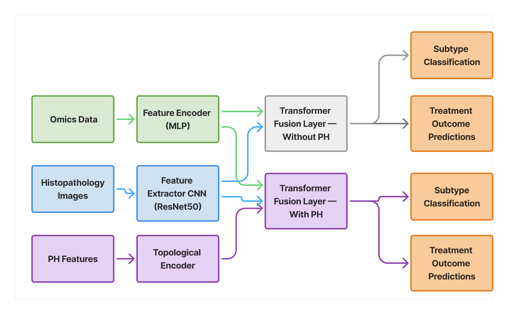

# TopFormer: A multimodal transformer for cervical cancer outcome prediction
A PathOmics-based Transformer architecture for cervical cancer subtype classification and treatment outcome prediction using histpathology, multi-omics and topological features.

## Project Overview

This repository contains the full codebase, data-processing scripts, and analysis artifacts for a **Transformer-based predictive model** designed to classify **treatment outcome** and **histological subtype** in **TCGA-CESC (Cervical Squamous Cell Carcinoma and Endocervical Adenocarcinoma)**.
PathOmics model used for transfer learning: https://github.com/Cassie07/PathOmics
The model incorporates:

- **Whole-slide image–derived pathomics features**
- **Omics-derived descriptors**
- **Persistent Homology (PH) features** capturing cellular-structure topology
- A **Transformer encoder** to integrate heterogeneous features
- A complete **training, validation, and evaluation pipeline**, developed and executed on the **Ilifu High-Performance Computing (HPC) cluster**

This work supports high-dimensional, multi-modal cancer prediction using topological data analysis, and includes all tools required to reproduce the results.

Full scientific write up: [paper link](https://1drv.ms/b/c/16477efef2486152/EUM5m4jkzuNEiKknFrSon1wBJdaDpHt4k8uP8yRc_qFD2g?e=CLa3bj)
---

---

## Data Description

This project uses data from:

### **TCGA-CESC (Cervical Cancer)**  
- Histopathology Whole Slide Images (WSIs)  
- Genomic data ( RNA-seq, DNA Methylation, Somatic Mutation, Copy Number Variation )
- Clinical metadata  
- PH topological descriptors extracted from imaging features  

**Raw TCGA data cannot be redistributed here.**  

---

##  Running the Project on Ilifu (HPC)

All training and preprocessing code was developed and executed on the **[Ilifu cluster](https://www.ilifu.ac.za/)**.

---
##  Prerequites 
python 3.8.18
Pytorch 2.0.1
pytorch-cuda 11.8
Torchvision 0.15.2
Pillow 9.4.0
numpy 1.24.3
pandas 2.0.3
scikit-survival 0.21.0 
scikit-learn 1.2.0
h5py 2.8.0

---

## Pipeline Diagram

> **Note:** The following commands are for Windows PowerShell. For Unix/Linux/macOS, use the alternative shown below.

## Model Training
Model was trained on Cervival Cancer data but can be adapted to different diseases with match matching sample IDs
